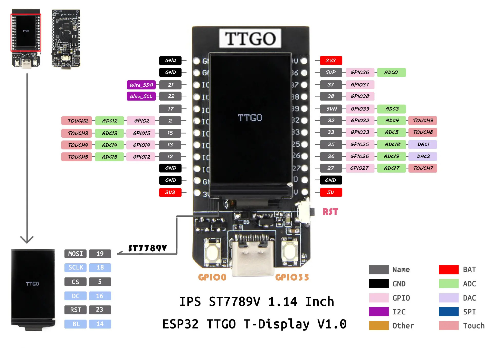

# TTGO Forth

This is a fork of Brad Nelson's excellent collaboration with Dr Ting to bring eForth to the ESP32 architecture.

My version, which starts from Brad's version 6.3 uses TFT_eSPI graphics drivers to write to the TTGO T-Display which has an onboard OLED display. The goal here is to use Forth to produce colour graphics. 

The graphics however are completely optional and this code should work well with any similar ESP32 device.

I've modified the code to compile under the [PlatformIO IDE](https://platformio.org/platformio-ide) rather than the Arduino IDE. It still uses Arduino libraries so it should be very simple to modify this project to use that IDE.

You communicate with Forth on the ESP32 via the web browser. Unlike Brad's version, mine doesn't hard code the IP address but leaves it to your Wifi's DHCP server to dynamically assign an IP address. It uses mDNS to associate a friendly domain name to connect to your ESP32 device such as http://eforth.local/

# Installation

Before you begin:

1. modify the `/include/credentials-template.h` to include your Wifi network's name (ssid) and password.

```C
// put information here which is specific to your system which
// you don't want to store in your GitHub repository
// for example your Wifi ssid and password
// before running this program rename this file to credentials.h

const char* ssid = "YOUR_WIFI_SSID";
const char* pass = "YOUR_WIFI_PASSWORD";
```

2. rename `/include/credentials_template.h` to `/include/credentials.h`
3. plug in your esp32 device to your USB port.
4. use PlatformIO to build and upload this project to your ESP32 device.
